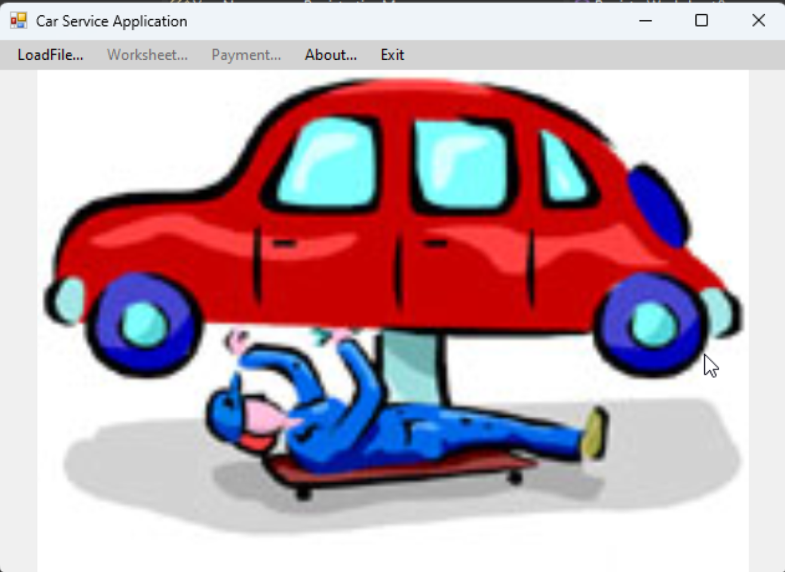
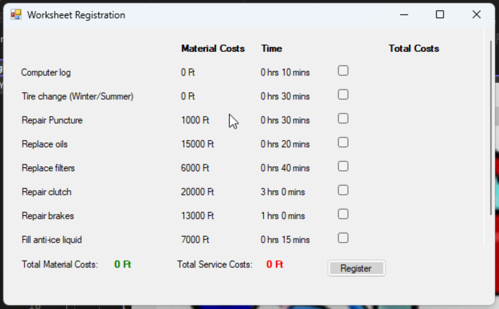
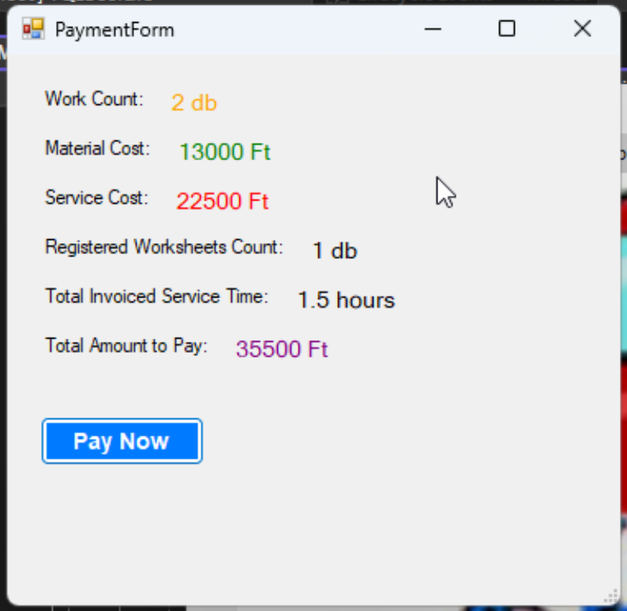
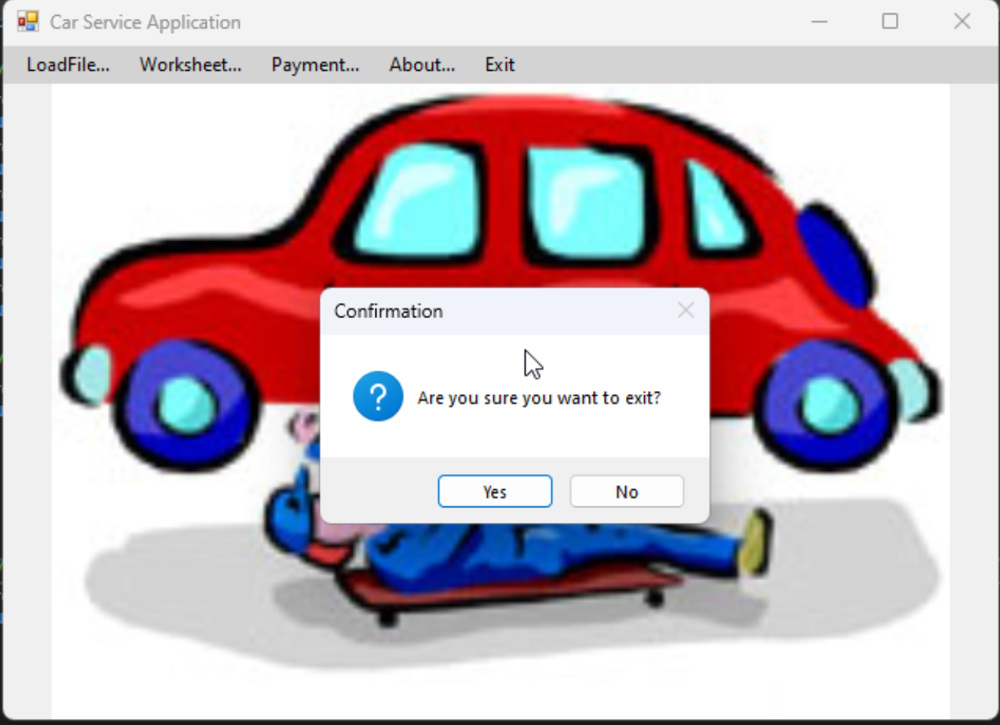

# CarServiceApplication
An object-oriented WindowsForms application for a car service, to store worksheets.













## User Stories
1. Load list of works can be done in the service from a text file
2. Provide an option to register worksheets
3. Show a list of works that can be ordered with details (name, execution time [xhours, yminutes])
4. Order works with selection (only one can be ordered)
5. Service fees and material costs are calculated
6. Before paying the order, more worksheets can be registered
7. On payment, all registered worksheets are paid
8. Show an About window with the current date and NEPTUN code of the student
9. On closing the program, a confirmation message is shown, leave the program only when the YES answer is selected

## Specifications
1. Apply object-oriented programming principles and tools when designing and implementing program components and their communication
2. Show a background image on the main form (use attached or find one)
3. Items of the main menu are only accessible when their function can be used. Otherwise, they must be disabled.
4. In the application 1 workhour costs 15000HUF
5. Service time of ordered works are summarized
6. **All started 30 minutes are invoiced**

###  File loading – technical specification
* Implement loading of text data files conforming to object-oriented principles
* LoadFilemethod of Loader generic class returns a List of instances created based on lines of the data file. Responsible for creating columns from lines
* Instantionation from Stringarray of row columns is done by an instance of a parser class
* Declaration of method of the parser class which creates Workinstances: `Work Parse(String[] colums)`
* The data members of Workclass must be private, Instance states are NOT subject to change through lifecycle of objects.
* In Workclass no property validation is required, use automatic properties.
* Workclass must contain properties to calculate Hour and Minutes of service time
* When loading the contents of a file, previously loaded works are deleted

### Data file format
Structure of text file:
`Name of work; Required time in minutes; Material costs`

```
Computer log;10;0
Tire change (Winter/Summer);30;0
Repair puncture;30;1000
Replace oils;20;15000
Replace filters;40;6000
Repair clutch;180;20000
Repair brakes;60;13000
Fill anti-ice liquid;15;7000
Repair lights;20;3000
```

### User interface – worksheet registration
* Dynamically handle works to select. The area is scrollable to see all work options
* List works with their details in the order they appeared in the data file
* On work selection, total material and service costs are automatically updated
* When pressing the Register button, the worksheet is registered, and the window is closed
* When closing the window without registration, a confirmation message is shown and the window is closed only on the YES answer
* When opening the window again, a new worksheet can be registered

### Payment of registered works
* When selecting the Payment…item of the main menu, a new window is opened with the summarized data of registered worksheets
  - Number of registered worksheets
  - Number of registered works
  - Material cost
  - Service cost
  - Total invoiced service time
  - Total amount to pay
* When this window is closed, all registered worksheets are deleted
* Design and implement the object-oriented solution for managing worksheets
* Implement all required user interface components
